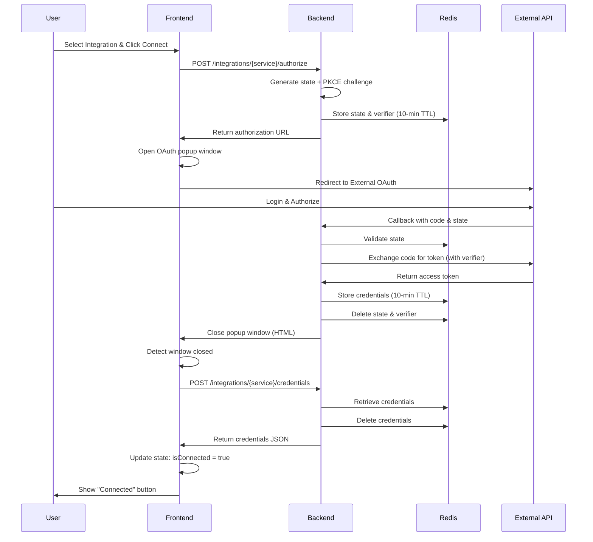
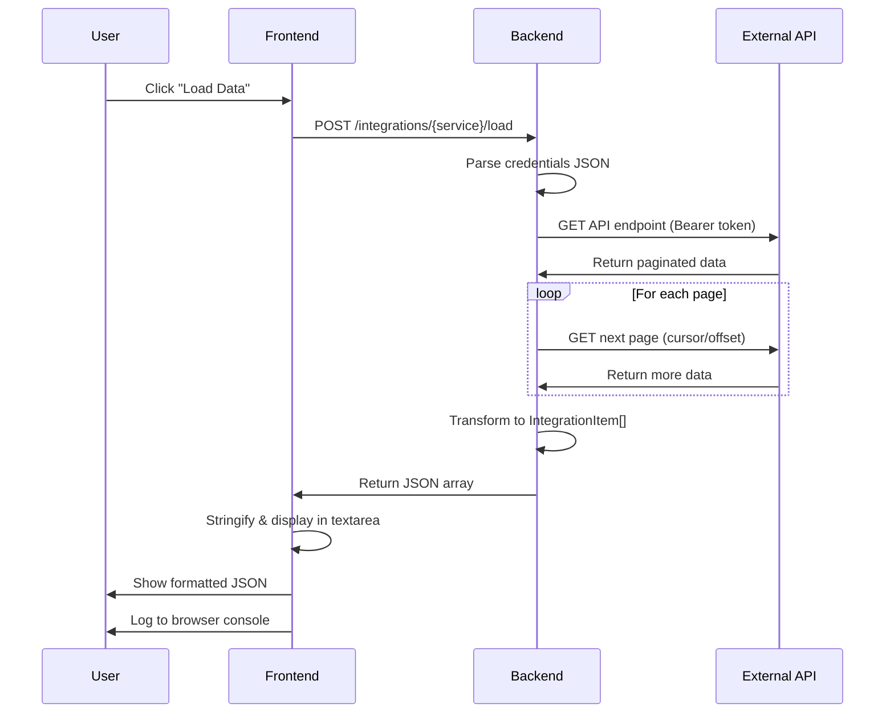
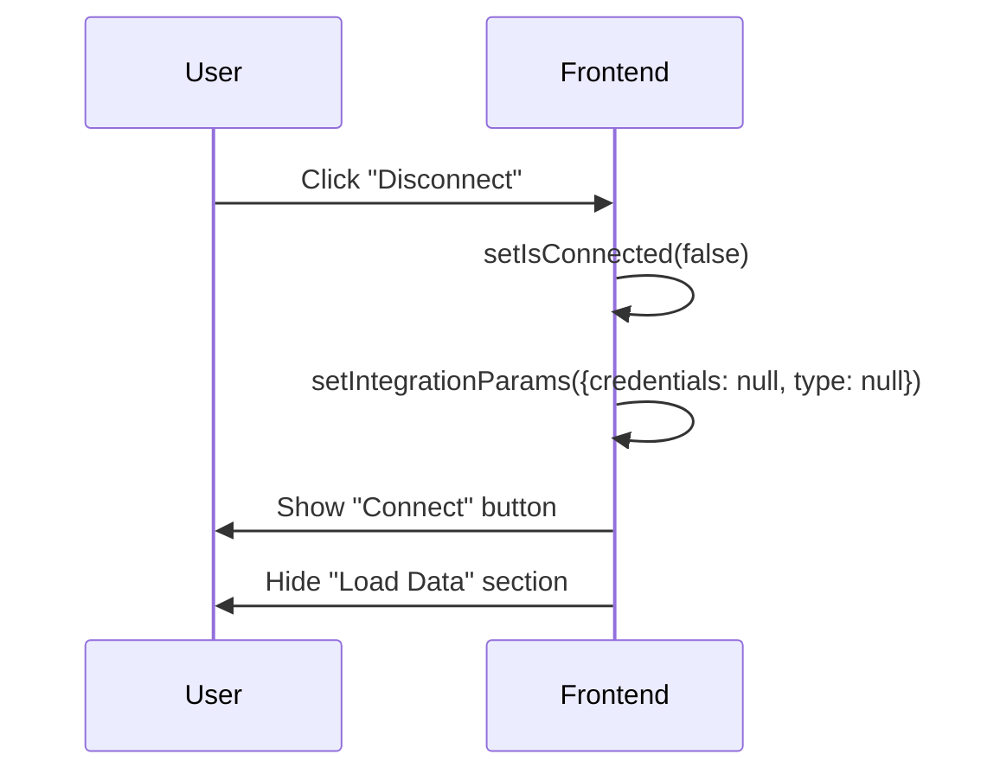

# VectorShift Integrations - Architecture & Flow Diagrams

## Table of Contents
1. [System Architecture](#system-architecture)
2. [OAuth2 Flow Diagram](#oauth2-flow-diagram)
3. [Data Loading Flow](#data-loading-flow)
4. [Component Architecture](#component-architecture)
5. [Database & State Management](#database--state-management)
6. [Sequence Diagrams](#sequence-diagrams)

---

## System Architecture

### High-Level Overview

```
┌─────────────────────────────────────────────────────────────────┐
│                        USER BROWSER                              │
│  ┌───────────────────────────────────────────────────────────┐  │
│  │  React Frontend (localhost:3000)                          │  │
│  │  ├─ Integration Selector                                  │  │
│  │  ├─ OAuth Connect Button                                  │  │
│  │  └─ Data Display Component                                │  │
│  └───────────────────────────────────────────────────────────┘  │
└───────────────────────────┬─────────────────────────────────────┘
                            │ HTTP/HTTPS
                            ▼
┌─────────────────────────────────────────────────────────────────┐
│               FastAPI Backend (localhost:8000)                   │
│  ┌──────────────────────────────────────────────────────────┐   │
│  │  main.py - API Routes                                    │   │
│  │  ├─ /integrations/{service}/authorize                    │   │
│  │  ├─ /integrations/{service}/oauth2callback               │   │
│  │  ├─ /integrations/{service}/credentials                  │   │
│  │  └─ /integrations/{service}/load                         │   │
│  └──────────────────────────────────────────────────────────┘   │
│                                                                   │
│  ┌──────────────────────────────────────────────────────────┐   │
│  │  Integration Modules                                     │   │
│  │  ├─ hubspot.py    - HubSpot OAuth & Data Fetching       │   │
│  │  ├─ airtable.py   - Airtable OAuth & Data Fetching      │   │
│  │  └─ notion.py     - Notion OAuth & Data Fetching        │   │
│  └──────────────────────────────────────────────────────────┘   │
└───────────────┬───────────────────────────┬─────────────────────┘
                │                           │
                │                           │ OAuth2 Token Exchange
                │                           ▼
                │              ┌─────────────────────────┐
                │              │   External APIs         │
                │              │  ├─ HubSpot API        │
                │              │  ├─ Airtable API       │
                │              │  └─ Notion API         │
                │              └─────────────────────────┘
                │
                ▼
    ┌──────────────────────┐
    │   Redis (Port 6379)  │
    │  Temporary Storage   │
    │  ├─ OAuth States     │
    │  ├─ PKCE Verifiers   │
    │  └─ Credentials      │
    │    (10-min expiry)   │
    └──────────────────────┘
```

---

## OAuth2 Flow Diagram

### Complete OAuth2 Authentication Flow with PKCE

```
User Browser          React Frontend         FastAPI Backend         Redis           External API
    │                      │                       │                    │                  │
    │  1. Select Integration                       │                    │                  │
    ├──────────────────────►                       │                    │                  │
    │                      │                       │                    │                  │
    │  2. Click "Connect"  │                       │                    │                  │
    ├──────────────────────►                       │                    │                  │
    │                      │                       │                    │                  │
    │                      │  3. POST /authorize   │                    │                  │
    │                      │   (user_id, org_id)   │                    │                  │
    │                      ├───────────────────────►                    │                  │
    │                      │                       │                    │                  │
    │                      │                       │  4. Generate:      │                  │
    │                      │                       │     - state token  │                  │
    │                      │                       │     - code_verifier│                  │
    │                      │                       │     - code_challenge                  │
    │                      │                       │                    │                  │
    │                      │                       │  5. Store in Redis │                  │
    │                      │                       ├────────────────────►                  │
    │                      │                       │   (10-min expiry)  │                  │
    │                      │                       │                    │                  │
    │                      │  6. Auth URL returned │                    │                  │
    │                      │◄───────────────────────                    │                  │
    │                      │                       │                    │                  │
    │  7. Open OAuth Popup │                       │                    │                  │
    │◄──────────────────────                       │                    │                  │
    │                      │                       │                    │                  │
    │  8. Redirect to External API                 │                    │                  │
    ├──────────────────────────────────────────────────────────────────────────────────────►
    │                      │                       │                    │                  │
    │  9. User Logs In & Authorizes                │                    │                  │
    ├──────────────────────────────────────────────────────────────────────────────────────►
    │                      │                       │                    │                  │
    │  10. Callback with code & state              │                    │                  │
    │◄─────────────────────────────────────────────────────────────────────────────────────┤
    │                      │                       │                    │                  │
    │  11. GET /oauth2callback?code=XXX&state=YYY  │                    │                  │
    ├──────────────────────────────────────────────►                    │                  │
    │                      │                       │                    │                  │
    │                      │                       │  12. Validate state│                  │
    │                      │                       ├────────────────────►                  │
    │                      │                       │◄────────────────────                  │
    │                      │                       │                    │                  │
    │                      │                       │  13. Exchange code for tokens         │
    │                      │                       │   (with code_verifier)                │
    │                      │                       ├───────────────────────────────────────►
    │                      │                       │                    │                  │
    │                      │                       │  14. Access Token  │                  │
    │                      │                       │◄───────────────────────────────────────┤
    │                      │                       │                    │                  │
    │                      │                       │  15. Store credentials                │
    │                      │                       ├────────────────────►                  │
    │                      │                       │   (10-min expiry)  │                  │
    │                      │                       │                    │                  │
    │  16. Close popup (HTML script)               │                    │                  │
    │◄─────────────────────────────────────────────┤                    │                  │
    │                      │                       │                    │                  │
    │  17. Poll detects closed window              │                    │                  │
    ├──────────────────────►                       │                    │                  │
    │                      │                       │                    │                  │
    │                      │  18. POST /credentials│                    │                  │
    │                      │   (user_id, org_id)   │                    │                  │
    │                      ├───────────────────────►                    │                  │
    │                      │                       │                    │                  │
    │                      │                       │  19. Retrieve & Delete                │
    │                      │                       ├────────────────────►                  │
    │                      │                       │◄────────────────────                  │
    │                      │                       │                    │                  │
    │                      │  20. Credentials JSON │                    │                  │
    │                      │◄───────────────────────                    │                  │
    │                      │                       │                    │                  │
    │  21. "Connected" ✓   │                       │                    │                  │
    │◄──────────────────────                       │                    │                  │
    │                      │                       │                    │                  │
```

---

## Data Loading Flow

### Fetching Data from External APIs

```
User Browser          React Frontend         FastAPI Backend         External API
    │                      │                       │                       │
    │  1. Click "Load Data"                        │                       │
    ├──────────────────────►                       │                       │
    │                      │                       │                       │
    │                      │  2. POST /load        │                       │
    │                      │   (credentials JSON)  │                       │
    │                      ├───────────────────────►                       │
    │                      │                       │                       │
    │                      │                       │  3. Parse credentials │
    │                      │                       │     Extract token     │
    │                      │                       │                       │
    │                      │                       │  4. API Request       │
    │                      │                       │   (Bearer token)      │
    │                      │                       ├───────────────────────►
    │                      │                       │                       │
    │                      │                       │  5. Paginated Data    │
    │                      │                       │◄───────────────────────
    │                      │                       │                       │
    │                      │                       │  6. More pages?       │
    │                      │                       │   (cursor/offset)     │
    │                      │                       ├───────────────────────►
    │                      │                       │◄───────────────────────
    │                      │                       │                       │
    │                      │                       │  7. Transform to      │
    │                      │                       │     IntegrationItem   │
    │                      │                       │     objects           │
    │                      │                       │                       │
    │                      │  8. List[IntegrationItem]                     │
    │                      │◄───────────────────────                       │
    │                      │                       │                       │
    │  9. Display JSON     │                       │                       │
    │◄──────────────────────                       │                       │
    │                      │                       │                       │
    │  10. Log to Console  │                       │                       │
    │◄──────────────────────                       │                       │
```

---

## Component Architecture

### Frontend Component Hierarchy

```
App.js
 │
 └── IntegrationForm
      ├── User Input (TextField)
      ├── Organization Input (TextField)
      ├── Integration Type Selector (Autocomplete)
      │    ├── Notion
      │    ├── Airtable
      │    └── HubSpot
      │
      ├── Integration Component (Dynamic)
      │    │
      │    ├── HubSpotIntegration
      │    │    ├── State: isConnected, isConnecting
      │    │    ├── Connect Button
      │    │    ├── Disconnect Button
      │    │    └── OAuth Popup Handler
      │    │
      │    ├── AirtableIntegration
      │    │    ├── State: isConnected, isConnecting
      │    │    ├── Connect Button
      │    │    ├── Disconnect Button
      │    │    └── OAuth Popup Handler
      │    │
      │    └── NotionIntegration
      │         ├── State: isConnected, isConnecting
      │         ├── Connect Button
      │         ├── Disconnect Button
      │         └── OAuth Popup Handler
      │
      └── DataForm (when connected)
           ├── Load Data Button
           ├── Clear Data Button
           └── Data Display (TextField with JSON)
```

### Backend Module Structure

```
backend/
 │
 ├── main.py (FastAPI App)
 │    ├── CORS Middleware
 │    └── API Routes
 │         ├── /integrations/hubspot/*
 │         ├── /integrations/airtable/*
 │         └── /integrations/notion/*
 │
 ├── redis_client.py
 │    ├── add_key_value_redis()
 │    ├── get_value_redis()
 │    └── delete_key_redis()
 │
 └── integrations/
      │
      ├── integration_item.py
      │    └── IntegrationItem (Data Class)
      │
      ├── hubspot.py
      │    ├── authorize_hubspot()
      │    ├── oauth2callback_hubspot()
      │    ├── get_hubspot_credentials()
      │    ├── create_integration_item_metadata_object()
      │    ├── fetch_contacts()
      │    └── get_items_hubspot()
      │
      ├── airtable.py
      │    ├── authorize_airtable()
      │    ├── oauth2callback_airtable()
      │    ├── get_airtable_credentials()
      │    ├── create_integration_item_metadata_object()
      │    ├── fetch_items()
      │    └── get_items_airtable()
      │
      └── notion.py
           ├── authorize_notion()
           ├── oauth2callback_notion()
           ├── get_notion_credentials()
           ├── create_integration_item_metadata_object()
           └── get_items_notion()
```

---

## Database & State Management

### Redis Key Structure

```
Redis Keys (10-minute TTL)
│
├── OAuth State Keys
│    ├── hubspot_state:{org_id}:{user_id}
│    │    └── {"state": "token", "user_id": "...", "org_id": "..."}
│    │
│    ├── airtable_state:{org_id}:{user_id}
│    │    └── {"state": "token", "user_id": "...", "org_id": "..."}
│    │
│    └── notion_state:{org_id}:{user_id}
│         └── {"state": "token", "user_id": "...", "org_id": "..."}
│
├── PKCE Verifier Keys
│    ├── hubspot_verifier:{org_id}:{user_id}
│    │    └── "code_verifier_string"
│    │
│    └── airtable_verifier:{org_id}:{user_id}
│         └── "code_verifier_string"
│
└── Credential Keys
     ├── hubspot_credentials:{org_id}:{user_id}
     │    └── {"access_token": "...", "expires_in": 3600, ...}
     │
     ├── airtable_credentials:{org_id}:{user_id}
     │    └── {"access_token": "...", "expires_in": 3600, ...}
     │
     └── notion_credentials:{org_id}:{user_id}
          └── {"access_token": "...", "workspace_id": "...", ...}
```

### Frontend State Management

```
IntegrationForm Component State
│
├── integrationParams
│    ├── credentials: Object | null
│    └── type: string | null
│
├── user: string (default: "TestUser")
├── org: string (default: "TestOrg")
└── currType: string | null


Integration Component State (HubSpot/Airtable/Notion)
│
├── isConnected: boolean
└── isConnecting: boolean


DataForm Component State
│
└── loadedData: Array | null
```

---

## Sequence Diagrams

### 1. Connection Flow (Detailed)



### 2. Data Loading Flow (Detailed)



### 3. Disconnect Flow



---

## Data Flow Architecture

### IntegrationItem Data Structure

```
External API Response
        │
        ▼
┌───────────────────────┐
│  Raw API Response     │
│  (JSON)               │
│  ├─ id                │
│  ├─ properties {...}  │
│  ├─ created_at        │
│  └─ updated_at        │
└───────────────────────┘
        │
        │ Transform via
        │ create_integration_item_metadata_object()
        ▼
┌───────────────────────┐
│  IntegrationItem      │
│  ├─ id: str           │
│  ├─ type: str         │
│  ├─ name: str         │
│  ├─ creation_time     │
│  ├─ last_modified_time│
│  ├─ url: str          │
│  ├─ parent_id: str    │
│  ├─ directory: bool   │
│  └─ ...               │
└───────────────────────┘
        │
        │ Serialize to JSON
        ▼
┌───────────────────────┐
│  JSON Response        │
│  [                    │
│    {                  │
│      "id": "...",     │
│      "type": "...",   │
│      "name": "..."    │
│    },                 │
│    ...                │
│  ]                    │
└───────────────────────┘
        │
        │ Send to Frontend
        ▼
┌───────────────────────┐
│  React State          │
│  loadedData: Array    │
└───────────────────────┘
        │
        │ Display
        ▼
┌───────────────────────┐
│  UI TextField         │
│  (formatted JSON)     │
└───────────────────────┘
```

---

## Environment Configuration Flow

```
.env file
  │
  ├─ HUBSPOT_CLIENT_ID ──────┐
  ├─ HUBSPOT_CLIENT_SECRET ──┤
  ├─ AIRTABLE_CLIENT_ID ─────┤
  ├─ AIRTABLE_CLIENT_SECRET ─┤
  ├─ NOTION_CLIENT_ID ───────┤
  └─ NOTION_CLIENT_SECRET ───┤
                             │
                             │ Loaded via
                             │ python-dotenv
                             ▼
                    ┌─────────────────┐
                    │  load_dotenv()  │
                    └─────────────────┘
                             │
                             │ os.getenv()
                             ▼
                    ┌─────────────────┐
                    │  Integration    │
                    │  Modules        │
                    │  ├─ hubspot.py  │
                    │  ├─ airtable.py │
                    │  └─ notion.py   │
                    └─────────────────┘
```

---

## Security Architecture

### Security Layers

```
┌─────────────────────────────────────────────────────────┐
│  Layer 1: PKCE (Proof Key for Code Exchange)           │
│  ├─ code_challenge generated from code_verifier         │
│  ├─ SHA-256 hash                                        │
│  └─ Prevents authorization code interception           │
└─────────────────────────────────────────────────────────┘
                         │
                         ▼
┌─────────────────────────────────────────────────────────┐
│  Layer 2: State Parameter Validation                    │
│  ├─ Random token generated per request                  │
│  ├─ Stored in Redis with TTL                           │
│  └─ Prevents CSRF attacks                              │
└─────────────────────────────────────────────────────────┘
                         │
                         ▼
┌─────────────────────────────────────────────────────────┐
│  Layer 3: Redis Expiry                                  │
│  ├─ All tokens expire in 10 minutes                    │
│  ├─ Credentials deleted after retrieval                │
│  └─ Minimizes exposure window                          │
└─────────────────────────────────────────────────────────┘
                         │
                         ▼
┌─────────────────────────────────────────────────────────┐
│  Layer 4: Environment Variables                         │
│  ├─ Secrets stored in .env (gitignored)                │
│  ├─ No hardcoded credentials                           │
│  └─ Platform-specific secrets in production            │
└─────────────────────────────────────────────────────────┘
                         │
                         ▼
┌─────────────────────────────────────────────────────────┐
│  Layer 5: HTTPS/TLS (Production)                       │
│  ├─ Encrypted communication                            │
│  ├─ Secure cookie flags                                │
│  └─ CORS restrictions                                  │
└─────────────────────────────────────────────────────────┘
```

---

## Deployment Architecture

### Development Environment

```
┌──────────────────────┐    ┌──────────────────────┐    ┌──────────────────────┐
│  React Dev Server    │    │  FastAPI Server      │    │  Redis Server        │
│  localhost:3000      │◄───┤  localhost:8000      │◄───┤  localhost:6379      │
│  (npm start)         │    │  (uvicorn)           │    │  (redis-server)      │
└──────────────────────┘    └──────────────────────┘    └──────────────────────┘
```

### Production Environment (Example)

```
┌─────────────────────────────────────────────────────────────────┐
│                         Load Balancer                            │
│                      (HTTPS/SSL Termination)                     │
└────────────────┬────────────────────────────────────────────────┘
                 │
        ┌────────┴────────┐
        │                 │
        ▼                 ▼
┌──────────────┐   ┌──────────────┐
│   Frontend   │   │   Backend    │
│   (CDN/S3)   │   │  (Container) │
│              │   │  ├─ FastAPI  │
│              │   │  └─ Gunicorn │
└──────────────┘   └──────┬───────┘
                          │
                          ▼
                 ┌─────────────────┐
                 │  Redis Cluster  │
                 │  (ElastiCache)  │
                 └─────────────────┘
```

---

## API Endpoint Reference

### Endpoint Map

| Method | Endpoint | Purpose | Request | Response |
|--------|----------|---------|---------|----------|
| POST | `/integrations/{service}/authorize` | Start OAuth flow | `user_id`, `org_id` | Authorization URL |
| GET | `/integrations/{service}/oauth2callback` | Handle OAuth callback | `code`, `state` (query params) | HTML (close window) |
| POST | `/integrations/{service}/credentials` | Get stored credentials | `user_id`, `org_id` | Credentials JSON |
| POST | `/integrations/{service}/load` | Fetch integration data | `credentials` (JSON) | IntegrationItem[] |

**Supported Services:** `hubspot`, `airtable`, `notion`

---

## Error Handling Flow

```
Error Occurs
     │
     ├─ Frontend Error
     │   ├─ Network Error
     │   │   └─ Display alert with error message
     │   │
     │   ├─ Popup Blocked
     │   │   └─ Alert user to allow popups
     │   │
     │   └─ OAuth Cancelled
     │       └─ Reset connection state
     │
     └─ Backend Error
         ├─ State Validation Failed
         │   └─ Return 400 with "State does not match"
         │
         ├─ Credentials Not Found
         │   └─ Return 400 with "No credentials found"
         │
         ├─ API Request Failed
         │   ├─ Log error to console
         │   └─ Return empty array or error response
         │
         └─ Token Expired
             └─ Require re-authentication
```

---

## Performance Considerations

### Optimization Points

1. **Redis TTL**: 10-minute expiry balances security and UX
2. **Pagination**: Handles unlimited data sets without memory issues
3. **Async Operations**: Non-blocking I/O for better throughput
4. **Connection Pooling**: Redis connection reuse
5. **Lazy Loading**: Components only rendered when needed

### Scalability

```
Single Instance            Multi-Instance
┌──────────┐              ┌──────────┐  ┌──────────┐
│ Backend  │              │ Backend  │  │ Backend  │
│   +      │              │ Instance │  │ Instance │
│  Redis   │       →      └─────┬────┘  └─────┬────┘
└──────────┘                    │             │
                                └──────┬──────┘
                                       │
                               ┌───────▼────────┐
                               │ Redis Cluster  │
                               └────────────────┘
```

---

## Summary

This architecture provides:
- ✅ **Security**: OAuth2 + PKCE + State validation
- ✅ **Scalability**: Async operations + Redis
- ✅ **Maintainability**: Modular design
- ✅ **Flexibility**: Environment-based configuration
- ✅ **User Experience**: Simple, intuitive flow
- ✅ **Extensibility**: Easy to add new integrations

Each integration follows the same pattern, making the system predictable and easy to extend with additional third-party services.
